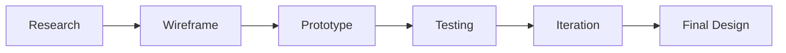

# 👋 Hi there, I'm [Your Name]

  
  
  
  
  
  

## 🎨 Designer | UI/UX Specialist | Creative Coder

> *"Design is not just what it looks like and feels like. Design is how it works."*

A passionate designer with a love for creating immersive experiences and solving complex design problems. I craft beautiful, functional, and accessible interfaces with user-centered design processes and the latest design trends.

## 🐍 Watch my contribution graph get eaten by the snake

  

## 🛠️ Design Tools & Technologies

  
  
  
  
  
  
  
  
  

## 🌟 Featured Projects

  
  

### [Project 1: App Design](https://github.com/your-username/project-1)
A mobile app redesign project that improved user experience by 40%. Incorporated modern design language and simplified navigation while adhering to WCAG 2.1 standards.

### [Project 2: Brand Identity](https://github.com/your-username/project-2)
A complete brand identity for a startup including logo, color scheme, typography, and UI guidelines. The project resulted in a 60% increase in brand recognition.

## 📊 My Design Process

## 💡 Design Philosophy

* **User-Centered**: Every design decision is based on real user needs
* **Accessible**: I create inclusive experiences that conform to WCAG standards
* **Modern & Timeless**: My designs are on-trend but built to last

## 📚 Recent Design Articles

* [UI Design Trends 2023](https://your-blog-url.com/post-1)
* [Effective Prototyping Strategies](https://your-blog-url.com/post-2)
* [Building Successful Design Systems](https://your-blog-url.com/post-3)

## 📈 GitHub Stats

  

## 📫 Contact

Want to discuss a project or collaboration? Reach out to me!

📧 Email: your-email@example.com
💬 Discord: yourname#1234

---

  
   
  

 