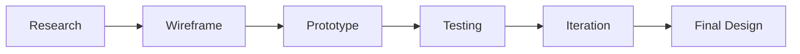

# 👋 Hi there, I'm Abhishek Kumar Gupta

  
  
  
  
  
  

## 🎨 FULL STACK DEVELOPER  | UI/UX Specialist | REACT.JS/NODE.JS

> *"Design is not just what it looks like and feels like. Design is how it works."*

A passionate designer with a love for creating immersive experiences and solving complex design problems. I craft beautiful, functional, and accessible interfaces with user-centered design processes and the latest design trends.

## 🐍 Watch my contribution graph get eaten by the snake

  

## 🛠️ Design Tools & Technologies

  
  
  
  
  
  
  
  
  

## 🌟 Featured Projects

  
  

### [Project 1: Pass-X Password Manager](https://password-manager-v2-1.onrender.com/login)
A secure password management application that helps users store and organize their credentials. Features include encryption, password generation, and intuitive user interface designed for maximum security and ease of use.

### [Project 2: AgeCalcPro - Age Calculator](https://celebrated-sprinkles-05c8f0.netlify.app/)
A sleek age calculator application that precisely calculates age in years, months, and days. The bilingual interface supports both English and Hindi, with a clean, responsive design for all devices.

### [Project 3: KaryaPath - To-Do List](https://regal-liger-1b7b7c.netlify.app/)
A productivity tool that helps users organize tasks with a clean, intuitive interface. Features include task categorization, completion tracking, and a responsive design that works across all devices.

## 📊 My Design Process

## 💡 Design Philosophy

* **User-Centered**: Every design decision is based on real user needs
* **Accessible**: I create inclusive experiences that conform to WCAG standards
* **Modern & Timeless**: My designs are on-trend but built to last

## 📚 Recent Design Articles

* [UI Design Trends 2023](https://your-blog-url.com/post-1)
* [Effective Prototyping Strategies](https://your-blog-url.com/post-2)
* [Building Successful Design Systems](https://your-blog-url.com/post-3)

## 📈 GitHub Stats

  

## 📫 Contact

Want to discuss a project or collaboration? Reach out to me!

📧 Email: dr.abhi8928@gmail.com
💬 Discord: developerabhi02

---

  
   
  

 
