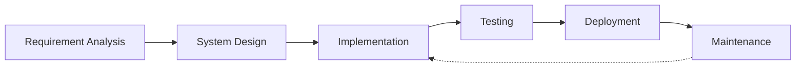

# 
👋 Hi there, I'm Abhishek Kumar Gupta

  

  
  
  
  

## 💻 Full-Stack MERN Developer

> *"Code is like humor. When you have to explain it, it's bad."* – Cory House

I'm a passionate Full-Stack Developer specializing in the MERN stack. I love building robust, scalable applications that solve real-world problems. With a strong foundation in both frontend and backend technologies, I create seamless user experiences backed by solid architecture.

## 🐍 Watch my contribution graph get eaten by the snake

  <picture>
    <source media="(prefers-color-scheme: dark)" srcset="https://raw.githubusercontent.com/developerabhi02/developerabhi02/output/github-contribution-grid-snake-dark.svg" />
    <source media="(prefers-color-scheme: light)" srcset="https://raw.githubusercontent.com/developerabhi02/developerabhi02/output/github-contribution-grid-snake.svg" />
    
  </picture>

## 🛠️ Tech Stack & Tools

  <!-- Frontend -->
  
  
  
  
  
  
  
  <!-- Backend -->
  
  
  
  
  
  <!-- Programming Languages -->
  
  
  
  
  
  <!-- Tools -->
  
  
  
  
  

## 🌟 Featured Projects

  
  

### [Pass-X Password Manager](https://password-manager-v2-1.onrender.com/login)
A secure password management application built with the MERN stack. Features include:
- End-to-end encryption for maximum security
- Intuitive user interface with responsive design
- Password generation and strength analysis
- Cross-device synchronization
- **Tech Stack**: React, Node.js, Express, MongoDB, JWT Authentication

### [AgeCalcPro - Age Calculator](https://celebrated-sprinkles-05c8f0.netlify.app/)
A sleek age calculator application with bilingual support:
- Precise calculation of age in years, months, and days
- Bilingual interface (English and Hindi)
- Responsive design for all devices
- Clean, modern UI with intuitive controls
- **Tech Stack**: HTML, CSS, JavaScript, React

### [KaryaPath - To-Do List](https://regal-liger-1b7b7c.netlify.app/)
A productivity tool for task management:
- Task categorization and priority setting
- Completion tracking with visual indicators
- Responsive design for desktop and mobile
- Local storage for persistent data
- **Tech Stack**: React, CSS3, LocalStorage API

## 📊 Development Workflow

## 💡 Coding Philosophy

* **Clean Code**: I write maintainable, readable, and efficient code
* **User-Centric**: Every feature is designed with the end-user in mind
* **Continuous Learning**: Always exploring new technologies and best practices
* **Problem Solver**: I enjoy tackling complex challenges with elegant solutions

## 📈 GitHub Stats

  
  

  

## 📫 Contact

Want to discuss a project or collaboration? Reach out to me!

📧 Email: dr.abhi8928@gmail.com  
💼 LinkedIn: [Abhishek Kumar Gupta](https://linkedin.com/in/abhishek-kumar-gupta)  
🌐 Portfolio: [View Portfolio](https://abhiportfolio-developerabhi02s-projects.vercel.app/)

---

  
   
  

 