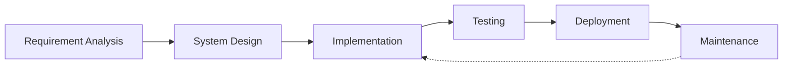

# <div align="center">👋 Hi there, I'm Abhishek Kumar Gupta</div>

<div align="center">
    
</div>

<div align="center">
  
</div>

<div align="center">
  
  <a href="https://komarev.com/ghpvc/?username=developerabhi02">
    
  </a>
</div>

<div align="center">
  <a href="https://abhiportfolio-developerabhi02s-projects.vercel.app/" target="_blank">
    
  </a>
  <a href="https://www.linkedin.com/in/developerabhi02/" target="_blank">
    
  </a>
  <a href="mailto:dr.abhi8928@gmail.com" target="_blank">
    
  </a>
  <a href="https://github.com/developerabhi02" target="_blank">
    
  </a>
</div>

<div style="background: linear-gradient(45deg, #12c2e9, #c471ed, #f64f59); padding: 20px; border-radius: 10px; margin: 20px 0;">

## 💻 Full-Stack MERN Developer

> *"Code is like humor. When you have to explain it, it's bad."* – Cory House

I'm a passionate Full-Stack Developer specializing in the MERN stack. I love building robust, scalable applications that solve real-world problems. With a strong foundation in both frontend and backend technologies, I create seamless user experiences backed by solid architecture.

## 🛠️ Tech Stack & Tools

<p align="center">
  
</p>

<div align="center" style="transform-style: preserve-3d; perspective: 1000px;">
  <table align="center" style="transform: rotateX(10deg); box-shadow: 0 10px 30px rgba(0,0,0,0.3); border-radius: 15px; background: rgba(255,255,255,0.1); backdrop-filter: blur(10px);">
    <tr style="transition: all 0.3s ease;">
      <td align="center" width="96" style="padding: 20px; transition: transform 0.3s ease;">
        <div style="transform-style: preserve-3d; transition: transform 0.3s ease;">
          
          <br><span style="font-weight: bold; color: #ffffff; text-shadow: 2px 2px 4px rgba(0,0,0,0.3);">JavaScript</span>
        </div>
      </td>
      <td align="center" width="96" style="padding: 20px;">
        <div style="transform-style: preserve-3d;">
          
          <br><span style="font-weight: bold; color: #ffffff; text-shadow: 2px 2px 4px rgba(0,0,0,0.3);">React</span>
        </div>
      </td>
      <td align="center" width="96" style="padding: 20px;">
        <div style="transform-style: preserve-3d;">
          
          <br><span style="font-weight: bold; color: #ffffff; text-shadow: 2px 2px 4px rgba(0,0,0,0.3);">GitHub</span>
        </div>
      </td>
      <td align="center" width="96" style="padding: 20px;">
        <div style="transform-style: preserve-3d;">
          
          <br><span style="font-weight: bold; color: #ffffff; text-shadow: 2px 2px 4px rgba(0,0,0,0.3);">Node.js</span>
        </div>
      </td>
      <td align="center" width="96" style="padding: 20px;">
        <div style="transform-style: preserve-3d;">
          
          <br><span style="font-weight: bold; color: #ffffff; text-shadow: 2px 2px 4px rgba(0,0,0,0.3);">MongoDB</span>
        </div>
      </td>
    </tr>
  </table>
</div>

</div>

## :man_technologist: About Me
> - 🌱 I'm currently learning Next.js, TypeScript, and advanced React patterns
> - 🔭 Working on exciting MERN stack projects and exploring cloud technologies
> - 🤖 Experimenting with AI integrations in web applications
> - 💬 Ask me about JavaScript, React, Node.js, or MongoDB
> - ✨ Passionate about **Web Development** and **UI/UX Design**
> - ⚡ Fun fact: I can code for hours but can't decide what to eat for dinner

## 💻 Tech Stack 
-which I have worked with or just hands-on
| Categories      | Tools & Skills
| ----------- | ----------- | 
| 👩‍💻 Languages     |        |
| 🧩 Frameworks & Libraries |     |
| ⚡ Database   |   |
| 🖍 Design     |  |
| 👩‍💻 IDE    |  |
| 📱 OS         |  |
| ☁️ Hosting/Saas|    |
| 📈 Version Control |   |
| 📦 CI/CD |   |
| 🧪 Testing |  |
| 📱 Mobile |  |

## 🌟 Featured Projects

<div align="center">
  <a href="https://password-manager-v2-1.onrender.com/login" target="_blank">
    
  </a>
  <a href="https://celebrated-sprinkles-05c8f0.netlify.app/" target="_blank">
    
  </a>
</div>

### [Pass-X Password Manager](https://password-manager-v2-1.onrender.com/login)
A secure password management application built with the MERN stack. Features include:
- End-to-end encryption for maximum security
- Intuitive user interface with responsive design
- Password generation and strength analysis
- Cross-device synchronization
- **Tech Stack**: React, Node.js, Express, MongoDB, JWT Authentication

### [AgeCalcPro - Age Calculator](https://celebrated-sprinkles-05c8f0.netlify.app/)
A sleek age calculator application with bilingual support:
- Precise calculation of age in years, months, and days
- Bilingual interface (English and Hindi)
- Responsive design for all devices
- Clean, modern UI with intuitive controls
- **Tech Stack**: HTML, CSS, JavaScript, React

### [KaryaPath - To-Do List](https://regal-liger-1b7b7c.netlify.app/)
A productivity tool for task management:
- Task categorization and priority setting
- Completion tracking with visual indicators
- Responsive design for desktop and mobile
- Local storage for persistent data
- **Tech Stack**: React, CSS3, LocalStorage API

## 📊 Development Workflow



## 💡 Coding Philosophy

* **Clean Code**: I write maintainable, readable, and efficient code
* **User-Centric**: Every feature is designed with the end-user in mind
* **Continuous Learning**: Always exploring new technologies and best practices
* **Problem Solver**: I enjoy tackling complex challenges with elegant solutions

## 📈 GitHub Stats

<div align="center">
  
  
</div>

<div align="center">
  
</div>

<div align="center">
  <h2>⚡ Activity Graph</h2>
  
</div>

<div align="center">
  <h2>🎯 Skills Progress</h2>
  
  ```text
  JavaScript    ███████████████████░░   90%
  React         ██████████████████░░░   85%
  Node.js       ████████████████░░░░░   75%
  MongoDB       ███████████████░░░░░░   70%
  TypeScript    ███████████████░░░░░░   70%
  Next.js       ████████████░░░░░░░░░   60%
  Docker        ██████████░░░░░░░░░░░   50%
  ```
</div>

## 🐍 My Contributions Snake Eating My Graph

<div align="center">
  <picture>
    <source
      media="(prefers-color-scheme: dark)"
      srcset="https://raw.githubusercontent.com/developerabhi02/developerabhi02/output/github-contribution-grid-snake-dark.svg"
    />
    <source
      media="(prefers-color-scheme: light)"
      srcset="https://raw.githubusercontent.com/developerabhi02/developerabhi02/output/github-contribution-grid-snake.svg"
    />
    
  </picture>

  <br/>
  <em>🎮 Watch the snake eat my contributions! 🐍</em>
</div>

## 📫 Contact

Want to discuss a project or collaboration? Reach out to me!

📧 Email: dr.abhi8928@gmail.com  
💼 LinkedIn: [Abhishek Kumar Gupta](https://www.linkedin.com/in/developerabhi02/)  
🌐 Portfolio: [View Portfolio](https://abhiportfolio-developerabhi02s-projects.vercel.app/)

<div align="center">
  <h2>🏆 GitHub Trophies</h2>
  
</div>

<div align="center">
  
  <h3>Thanks for visiting! Here's a coding joke for you:</h3>
  
</div>

<div align="center">
  
</div>

---

<div align="center">
  
  <br />
  <a href="https://www.buymeacoffee.com/abhishekgupta" target="_blank">
    
  </a>
</div> 