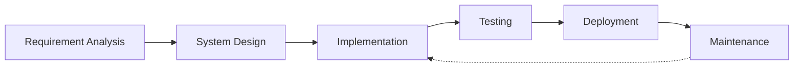

<div align="center">
  

# Hii , I'm Abhishek Kumar Gupta !!
### MERN Stack Developer


[](https://git.io/typing-svg)


<a href="https://abhiportfolio-developerabhi02s-projects.vercel.app/" target="_blank">
  
</a>
<a href="https://www.linkedin.com/in/developerabhi02/" target="_blank">
  
</a>
<a href="mailto:dr.abhi8928@gmail.com" target="_blank">
  
</a>
<a href="https://github.com/developerabhi02" target="_blank">
  
</a>
</div>

## 💫 About Me

I'm a passionate Full-Stack Developer with expertise in the MERN stack. I transform ideas into elegant, scalable solutions that make a real impact. My code is not just functional – it's crafted with care, optimized for performance, and built to last.

### 🚀 Current Focus
- 🔭 Building innovative MERN stack applications
- 🌱 Mastering Next.js and TypeScript
- 🤖 Exploring AI/ML integrations in web apps

### 💡 Fun Facts
- ⚡ Code debugger by day, bug creator by night
- 🎮 Gaming enthusiast when not coding
- ☕ Powered by coffee and curiosity

## 🛠️ Technology Arsenal

<div align="center">
  
  
  
  
  
</div>

## 🌟 Featured Projects

<div align="center">

### 🔐 Pass-X Password Manager

```
🔓 PASSWORD SECURITY & MANAGEMENT
```

> A secure password management solution with end-to-end encryption and seamless synchronization across devices.


[View Project →](https://password-manager-v2-1.onrender.com/login)

---

### 📅 AgeCalcPro

```
⏳ AGE CALCULATION & TIMELINE
```

> A bilingual age calculator with precise calculations and an intuitive interface for all users.


[View Project →](https://celebrated-sprinkles-05c8f0.netlify.app/)

---

### ✅ KaryaPath

```
📋 TASK MANAGEMENT & ORGANIZATION
```

> A modern task management application with local storage persistence and clean UI/UX.


[View Project →](https://regal-liger-1b7b7c.netlify.app/)

</div>

## 📊 Development Workflow



## 💡 Coding Philosophy

* **Clean Code**: I write maintainable, readable, and efficient code
* **User-Centric**: Every feature is designed with the end-user in mind
* **Continuous Learning**: Always exploring new technologies and best practices
* **Problem Solver**: I enjoy tackling complex challenges with elegant solutions

## 📈 GitHub Stats


## 📫 Contact

Want to discuss a project or collaboration? Reach out to me!

📧 Email: dr.abhi8928@gmail.com  
💼 LinkedIn: [Abhishek Kumar Gupta](https://www.linkedin.com/in/developerabhi02/)  
🌐 Portfolio: [View Portfolio](https://abhiportfolio-developerabhi02s-projects.vercel.app/)

---

<div align="center">
  
  <br />
  <a href="https://www.buymeacoffee.com/abhishekgupta" target="_blank">
    
  </a>
</div> 
