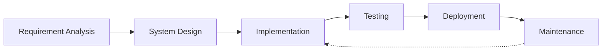

# <div align="center">👋 Hi there, I'm Abhishek Kumar Gupta</div>

<div align="center">
    
</div>

<div align="center">
  
</div>

<div align="center">
  
  <a href="https://komarev.com/ghpvc/?username=developerabhi02">
    
  </a>
</div>

<div align="center" style="margin: 20px 0;">
  <a href="https://abhiportfolio-developerabhi02s-projects.vercel.app/" target="_blank" rel="noopener noreferrer" style="text-decoration: none; margin: 0 10px;">
    
  </a>
  <a href="https://www.linkedin.com/in/developerabhi02/" target="_blank" rel="noopener noreferrer" style="text-decoration: none; margin: 0 10px;">
    
  </a>
  <a href="mailto:dr.abhi8928@gmail.com" target="_blank" rel="noopener noreferrer" style="text-decoration: none; margin: 0 10px;">
    
  </a>
  <a href="https://github.com/developerabhi02" target="_blank" rel="noopener noreferrer" style="text-decoration: none; margin: 0 10px;">
    
  </a>
</div>

<div style="background: linear-gradient(120deg, #1a1b27, #2a2c3e); padding: 30px; border-radius: 20px; margin: 30px 0; box-shadow: 0 10px 30px rgba(0,0,0,0.2);">
  <h2 align="center" style="color: #2F81F7; font-size: 28px; margin-bottom: 20px;">💫 About Me</h2>
  
  <p align="center" style="color: #a9b1d6; font-size: 16px; line-height: 1.6; margin-bottom: 25px;">
    I'm a passionate Full-Stack Developer with expertise in the MERN stack. I transform ideas into elegant, scalable solutions that make a real impact. My code is not just functional – it's crafted with care, optimized for performance, and built to last.
  </p>

  <div style="display: grid; grid-template-columns: repeat(2, 1fr); gap: 20px; margin-top: 20px;">
    <div style="background: rgba(47, 129, 247, 0.1); padding: 15px; border-radius: 12px;">
      <h3 style="color: #2F81F7; margin-bottom: 10px;">🚀 Current Focus</h3>
      <ul style="color: #a9b1d6; list-style-type: none; padding: 0;">
        <li>🔭 Building innovative MERN stack applications</li>
        <li>🌱 Mastering Next.js and TypeScript</li>
        <li>🤖 Exploring AI/ML integrations in web apps</li>
      </ul>
    </div>
    <div style="background: rgba(47, 129, 247, 0.1); padding: 15px; border-radius: 12px;">
      <h3 style="color: #2F81F7; margin-bottom: 10px;">💡 Fun Facts</h3>
      <ul style="color: #a9b1d6; list-style-type: none; padding: 0;">
        <li>⚡ Code debugger by day, bug creator by night</li>
        <li>🎮 Gaming enthusiast when not coding</li>
        <li>☕ Powered by coffee and curiosity</li>
      </ul>
    </div>
  </div>
</div>

<h2 align="center" display="flex" style="color: #2F81F7; margin: 40px 0 20px;">🛠️ Technology Arsenal</h2>

<div style="background: linear-gradient(120deg, #1a1b27, #2a2c3e); padding: 30px; border-radius: 20px; margin: 20px 0;">
  <div style="display: flex; flex-wrap: wrap; justify-content: center; gap: 30px; align-items: center;">
    <!-- JavaScript -->
    <div style="text-align: center; transition: transform 0.3s; flex: 0 0 auto;">
      
      <p style="color: #2F81F7; margin-top: 10px; font-weight: bold;">JavaScript</p>
    </div>
    <!-- React -->
    <div style="text-align: center; transition: transform 0.3s; flex: 0 0 auto;">
      
      <p style="color: #2F81F7; margin-top: 10px; font-weight: bold;">React</p>
    </div>
    <!-- Node.js -->
    <div style="text-align: center; transition: transform 0.3s; flex: 0 0 auto;">
      
      <p style="color: #2F81F7; margin-top: 10px; font-weight: bold;">Node.js</p>
    </div>
    <!-- MongoDB -->
    <div style="text-align: center; transition: transform 0.3s; flex: 0 0 auto;">
      
      <p style="color: #2F81F7; margin-top: 10px; font-weight: bold;">MongoDB</p>
    </div>
    <!-- Express -->
    <div style="text-align: center; transition: transform 0.3s; flex: 0 0 auto;">
      
      <p style="color: #2F81F7; margin-top: 10px; font-weight: bold;">Express</p>
    </div>
  </div>
</div>

<h2 align="center" style="color: #2F81F7; margin: 40px 0 20px;">🌟 Featured Projects</h2>

<div style="display: grid; grid-template-columns: repeat(auto-fit, minmax(300px, 1fr)); gap: 30px; margin: 20px 0;">
  <!-- Pass-X Password Manager -->
  <div style="background: linear-gradient(135deg, #1a1b27, #2a2c3e); border-radius: 20px; overflow: hidden; transition: all 0.3s ease; position: relative;">
    <div class="ribbon" style="position: absolute; top: 20px; right: -35px; background: #2F81F7; color: white; padding: 5px 40px; transform: rotate(45deg); z-index: 1; font-size: 12px; box-shadow: 0 2px 5px rgba(0,0,0,0.2);">
      MERN Stack
    </div>
    <a href="https://password-manager-v2-1.onrender.com/login" target="_blank" rel="noopener noreferrer" style="text-decoration: none;">
      <div style="position: relative;">
        
        <div style="position: absolute; bottom: 0; left: 0; right: 0; background: linear-gradient(to top, rgba(26,27,39,0.9), transparent); height: 100%;"></div>
      </div>
      <div style="padding: 25px;">
        <h3 style="color: #2F81F7; font-size: 24px; margin: 0 0 15px;">Pass-X Password Manager</h3>
        <p style="color: #a9b1d6; font-size: 16px; line-height: 1.6; margin-bottom: 20px;">
          A secure password management solution with end-to-end encryption and seamless synchronization across devices.
        </p>
        <div style="display: flex; flex-wrap: wrap; gap: 10px; margin-bottom: 20px;">
          <span style="background: rgba(47,129,247,0.1); color: #2F81F7; padding: 5px 15px; border-radius: 20px; font-size: 14px;">React</span>
          <span style="background: rgba(47,129,247,0.1); color: #2F81F7; padding: 5px 15px; border-radius: 20px; font-size: 14px;">Node.js</span>
          <span style="background: rgba(47,129,247,0.1); color: #2F81F7; padding: 5px 15px; border-radius: 20px; font-size: 14px;">MongoDB</span>
        </div>
        <button style="width: 100%; padding: 12px; border: none; border-radius: 10px; background: linear-gradient(45deg, #2F81F7, #1a1b27); color: white; font-weight: bold; cursor: pointer; transition: all 0.3s ease;">
          View Project →
        </button>
      </div>
    </a>
  </div>

  <!-- AgeCalcPro -->
  <div style="background: linear-gradient(135deg, #1a1b27, #2a2c3e); border-radius: 20px; overflow: hidden; transition: all 0.3s ease; position: relative;">
    <div class="ribbon" style="position: absolute; top: 20px; right: -35px; background: #2F81F7; color: white; padding: 5px 40px; transform: rotate(45deg); z-index: 1; font-size: 12px; box-shadow: 0 2px 5px rgba(0,0,0,0.2);">
      React
    </div>
    <a href="https://celebrated-sprinkles-05c8f0.netlify.app/" target="_blank" rel="noopener noreferrer" style="text-decoration: none;">
      <div style="position: relative;">
        
        <div style="position: absolute; bottom: 0; left: 0; right: 0; background: linear-gradient(to top, rgba(26,27,39,0.9), transparent); height: 100%;"></div>
      </div>
      <div style="padding: 25px;">
        <h3 style="color: #2F81F7; font-size: 24px; margin: 0 0 15px;">AgeCalcPro</h3>
        <p style="color: #a9b1d6; font-size: 16px; line-height: 1.6; margin-bottom: 20px;">
          A bilingual age calculator with precise calculations and an intuitive interface for all users.
        </p>
        <div style="display: flex; flex-wrap: wrap; gap: 10px; margin-bottom: 20px;">
          <span style="background: rgba(47,129,247,0.1); color: #2F81F7; padding: 5px 15px; border-radius: 20px; font-size: 14px;">React</span>
          <span style="background: rgba(47,129,247,0.1); color: #2F81F7; padding: 5px 15px; border-radius: 20px; font-size: 14px;">JavaScript</span>
          <span style="background: rgba(47,129,247,0.1); color: #2F81F7; padding: 5px 15px; border-radius: 20px; font-size: 14px;">CSS3</span>
        </div>
        <button style="width: 100%; padding: 12px; border: none; border-radius: 10px; background: linear-gradient(45deg, #2F81F7, #1a1b27); color: white; font-weight: bold; cursor: pointer; transition: all 0.3s ease;">
          View Project →
        </button>
      </div>
    </a>
  </div>

  <!-- KaryaPath -->
  <div style="background: linear-gradient(135deg, #1a1b27, #2a2c3e); border-radius: 20px; overflow: hidden; transition: all 0.3s ease; position: relative;">
    <div class="ribbon" style="position: absolute; top: 20px; right: -35px; background: #2F81F7; color: white; padding: 5px 40px; transform: rotate(45deg); z-index: 1; font-size: 12px; box-shadow: 0 2px 5px rgba(0,0,0,0.2);">
      React
    </div>
    <a href="https://regal-liger-1b7b7c.netlify.app/" target="_blank" rel="noopener noreferrer" style="text-decoration: none;">
      <div style="position: relative;">
        
        <div style="position: absolute; bottom: 0; left: 0; right: 0; background: linear-gradient(to top, rgba(26,27,39,0.9), transparent); height: 100%;"></div>
      </div>
      <div style="padding: 25px;">
        <h3 style="color: #2F81F7; font-size: 24px; margin: 0 0 15px;">KaryaPath</h3>
        <p style="color: #a9b1d6; font-size: 16px; line-height: 1.6; margin-bottom: 20px;">
          A modern task management application with local storage persistence and clean UI/UX.
        </p>
        <div style="display: flex; flex-wrap: wrap; gap: 10px; margin-bottom: 20px;">
          <span style="background: rgba(47,129,247,0.1); color: #2F81F7; padding: 5px 15px; border-radius: 20px; font-size: 14px;">React</span>
          <span style="background: rgba(47,129,247,0.1); color: #2F81F7; padding: 5px 15px; border-radius: 20px; font-size: 14px;">LocalStorage</span>
          <span style="background: rgba(47,129,247,0.1); color: #2F81F7; padding: 5px 15px; border-radius: 20px; font-size: 14px;">CSS3</span>
        </div>
        <button style="width: 100%; padding: 12px; border: none; border-radius: 10px; background: linear-gradient(45deg, #2F81F7, #1a1b27); color: white; font-weight: bold; cursor: pointer; transition: all 0.3s ease;">
          View Project →
        </button>
      </div>
    </a>
  </div>
</div>

## 📊 Development Workflow



## 💡 Coding Philosophy

* **Clean Code**: I write maintainable, readable, and efficient code
* **User-Centric**: Every feature is designed with the end-user in mind
* **Continuous Learning**: Always exploring new technologies and best practices
* **Problem Solver**: I enjoy tackling complex challenges with elegant solutions

## 📈 GitHub Stats

<div align="center">
  
  
</div>

<div align="center">
  
</div>

<div align="center">
  <h2>⚡ Activity Graph</h2>
  
</div>

<div align="center">
  <h2>🎯 Skills Progress</h2>
  
  ```text
  JavaScript    ███████████████████░░   90%
  React         ██████████████████░░░   85%
  Node.js       ████████████████░░░░░   75%
  MongoDB       ███████████████░░░░░░   70%
  TypeScript    ███████████████░░░░░░   70%
  Next.js       ████████████░░░░░░░░░   60%
  Docker        ██████████░░░░░░░░░░░   50%
  ```
</div>

## 🐍 My Contributions Snake Eating My Graph

<div align="center">
  <picture>
    <source
      media="(prefers-color-scheme: dark)"
      srcset="https://raw.githubusercontent.com/developerabhi02/developerabhi02/output/github-contribution-grid-snake-dark.svg"
    />
    <source
      media="(prefers-color-scheme: light)"
      srcset="https://raw.githubusercontent.com/developerabhi02/developerabhi02/output/github-contribution-grid-snake.svg"
    />
    
  </picture>

  <br/>
  <em>🎮 Watch the snake eat my contributions! 🐍</em>
</div>

## 📫 Contact

Want to discuss a project or collaboration? Reach out to me!

📧 Email: dr.abhi8928@gmail.com  
💼 LinkedIn: [Abhishek Kumar Gupta](https://www.linkedin.com/in/developerabhi02/)  
🌐 Portfolio: [View Portfolio](https://abhiportfolio-developerabhi02s-projects.vercel.app/)

<div align="center">
  <h2>🏆 GitHub Trophies</h2>
  
</div>

<div align="center">
  
  <h3>Thanks for visiting! Here's a coding joke for you:</h3>
  
</div>

<div align="center">
  
</div>

---

<div align="center">
  
  <br />
  <a href="https://www.buymeacoffee.com/abhishekgupta" target="_blank">
    
  </a>
</div> 
